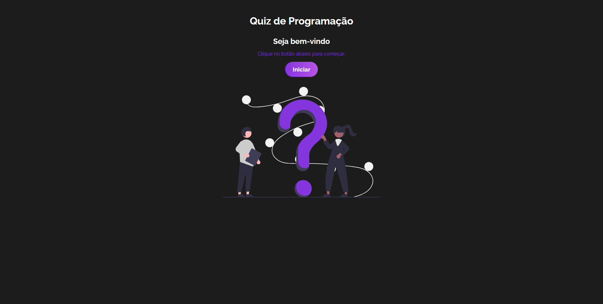

# Quiz de Programação




## <a href="https://quiz-amber-seven.vercel.app/" target="_blank">Quiz</a>

Projeto criado utilizando React e css.
O Projeto e um quiz de perguntas e respostas sobre programação, com ele você pode está respondendo varias perguntas e ganhamdo pontos.


## Instalação

Instale my-project com npm

```bash
  npm install quiz
  cd quiz
```
    
## Deploy

Para fazer o deploy desse projeto rode

```bash
  npm run dev
```


## Autores

- [@AlbericoJr](https://www.github.com/albericojr)


## Etiquetas

Adicione etiquetas de algum lugar, como: [shields.io](https://shields.io/)

[](https://choosealicense.com/licenses/mit/)
[](https://opensource.org/licenses/)
[](http://www.gnu.org/licenses/agpl-3.0)

